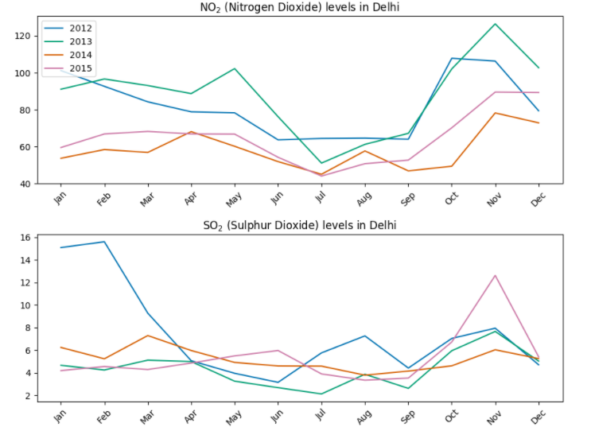

# Air-Pollution-Levels-Exploratory-Data-Analysis

# Description
A research project which attempts to explore the various levels of air pollution across the years 2012-2017. The project attempts to realize how various pollution control schemes introduced in Delhi in the recent years (such as the firecracker ban, odd-even scheme and disallowing the use of vehicles older than 10 years) have had an impact on the air pollution levels of Delhi. Data for more recent years is still in process of collection and it will be incorporated into the project soon. In the subsequent stages, we plan on predicting the air pollution for the following years. 

## UPDATE: Final Plot for data 2012 through 2015

# Technologies Used
  
- Python

- Pandas 

- Numpy

- Matplotlib

# Objective

Our project aims to spread awareness among people about the increasing pollution levels in India, especially during the months of October and November.
These sudden peaks in pollution levels are due to heavy burning of firecrackers in order to celebrate Diwali. By incorporating data and graphs into the project, we make it easier for people to observe how the burning of firecrackers can be menacing to the environment, and henceforth needs to be brought to a hault immediately.

# Data Sources

> data.gov.in  

